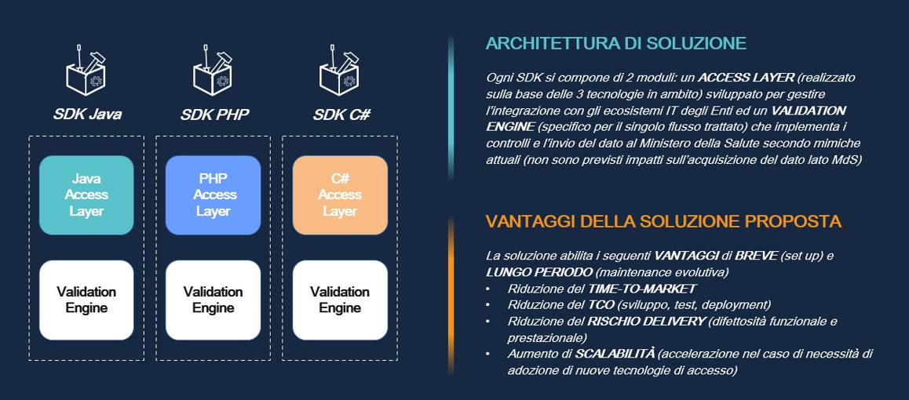

|
**PROGETTO SDK**

Specifiche funzionali
|
| :-: |

** 

**Progetto SDK**

**Area: Emergenza Urgenza**

**Flusso logico: EMUR Pronto Soccorso**

Specifiche Funzionali

**

**Indice**

[1.**	**Introduzione	3****](#_Toc124851300)**

[1.1	Obiettivi del documento	3](#_Toc124851301)

[1.2	Acronimi	4](#_Toc124851302)

[**2.**	**Architettura SDK	5****](#_Toc124851303)

[**3.**	**Funzionamento della soluzione SDK	8****](#_Toc124851306)

[3.1	Tracciato input a SDK	8](#_Toc124851307)

[3.2	Controlli di validazione del dato (business rules)	33](#_Toc124851308)

[3.3	Flussi di output per alimentazione MdS	130](#_Toc124851309)

[3.4	Scarti di processamento	133](#_Toc124851310)

[3.5	Informazioni dell’esecuzione	135](#_Toc124851311)

**Storia del documento** 

|Versione doc.|Data Revisione|Redatto da|Approvato da|Descrizione revisione|Cambi evidenziati|
| :- | :- | :- | :- | :- | :- |
|1.0|04/03/2022|
Antonella Topino

Alessandro Fanti
||Prima stesura||
|2.0|01/08/2021|Vittoria Ricci||Aggiornamento Business Rules e Tracciato contenuti nei file Excel.||
|3.0|28/11/2022|Vittoria Ricci||Aggiornamento Business Rules e Tracciato contenuti nei file Excel.||

|SDK\_HLD\_EMUR\_Pronto Soccorso\_v3.0.doc||Pag. 2 di 12|
| :- | :- | -: |

|
**PROGETTO SDK**

Specifiche funzionali
|
| :-: |

1. # **Introduzione**

1. ## ***Obiettivi del documento***

Il Ministero della Salute (MdS) metterà a disposizione degli Enti da cui riceve dati applicazioni SDK specifiche per flusso logico e tenoclogie applicative (Java, PHP e C#) per verifica preventiva (in casa Ente) della qualità del dato prodotto.

Nel presente documento sono fornite la struttura e la sintassi dei tracciati previsti dalla soluzione SDK per avviare il proprio processo elaborativo e i controlli di merito sulla qualità, completezza e coerenza dei dati.

Gli obiettivi del documento sono:

- fornire una descrizione funzionale chiara e consistente dei tracciati di input a SDK
- fornire le regole funzionali per la verifica di qualità, completezza e coerenza dei dati

In generale, la soluzione SDK è costituita da 2 diversi moduli applicativi (Access Layer e Validation Engine) per abilitare

- l’interoperabilità con il contesto tecnologico dell’Ente in cui la soluzione sarà installata
- la validazione del dato ed il suo successivo invio verso il MdS

La figura che segue descrive la soluzione funionale ed i relativi benefici attesi.

1. ## ***Acronimi***

Nella tabella riportata di seguito sono elencati tutti gli acronimi e le definizioni adottate nel presente documento. 

|**#**|**Acronimo / Riferimento**|**Definizione**|
| - | - | - |
|1|NSIS|Nuovo Sistema Informativo Sanitario|
|2|MdS|Ministero della Salute|
|3|SDK|Software Development Kit|
|4|EMUR|Emergenza Urgenza|
|5|PS|Pronto Soccorso|

1. # **Architettura SDK**

L'architettura degli SDK è disponibile al seguente link [`ARCHITECTURE.md`](https://github.com/ministero-salute/sdk-utilities-regole-properties/blob/main/ARCHITECTURE.md).
1. ## ***Tracciato input a SDK***

Il flusso di input avrà formato **csv** e una naming convention libera a discrezione dell’utente che carica il flusso senza alcun vincolo di nomenclatura specifica (es nome\_file.csv)

Il separatore per il file csv sarà il carattere tra doppi apici : “~“

In fase di caricamento del file verrano impostati i seguenti parametri che andranno in input al SDK in fase di processamento del file:

|**NOME PARAMETRO**|**DESCRIZIONE**|**LUNGHEZZA**|**DOMINIO VALORI**|
| :- | :- | :- | :- |
|ID CLIENT|Identificativo univoco della transazione che fa richiesta all'SDK|100|Non definito|
|NOME FILE INPUT|Nome del file per il quale si richiede il processamento lato SDK|256|Non definito|
|ANNO RIFERIMENTO|Stringa numerica rappresentante l’anno di riferimento per cui si intende inviare la fornitura|4|Anno (Es. 2022)|
|PERIODO RIFERIMENTO|Stringa alfanumerica rappresentante il periodo per il quale si intende inviare la fornitura; |3|**13** (rappresenta un alias per il quale MDS usa come data di competenza l’anno e il mese di riferimento del record piuttosto che il parametro periodo di riferimento passato in input alla procedura InvioFlussi)|
|TIPO TRASMISSIONE |Indica se la trassmissione dei dati verso MDS avverrà il modalità full (F) o record per record (R). Per questo flusso la valorizzazione del parametro sarà impostata di default a F|1|F/R|
|FINALITA’ ELABORAZIONE|Indica se i flussi in output prodotti dal SDK verranno inviati verso MDS (Produzione) oppure se rimarranno all’interno del SDK e il processamento vale solo come test del flusso (Test)|1|Produzione/Test|
|CODICE REGIONE|
Individua la Regione a cui afferisce la struttura. Il codice da utilizzare è quello a tre caratteri definito con DM 17 settembre 1986, pubblicato nella Gazzetta Ufficiale n.240 del 15 ottobre 1986, e successive modifiche, utilizzato anche nei modelli per le rilevazioni delle attività gestionali ed economiche delle Aziende unità sanitarie locali.

|3|Es. 010|

|` `SDK_HLD_EMUR_Pronto Soccorso_v3.0.doc||Pag. 8 di 11|
| :- | :- | -: |

|
**PROGETTO SDK**

Specifiche funzionali
|
| :-: |

Nella tabella seguente sono indicati i dettagli dei campi di business del tracciato di input atteso da SDK.

|**Posizione nel File**|**Nome elemento padre**|**Nome campo** |**Key**|**Descrizione**|**Tipo** |**Obbligatorietà**|**Informazioni di Dominio**|**Lunghezza campo**|**Tracciato di Output**|
| :-: | :-: | :-: | :-: | :-: | :-: | :-: | :-: | :-: | :-: |
|0| |Identificativo|KEY|Codice univoco che identifica il contatto del cittadino con il SSN, in questo caso l'accesso al PS.|N|OBB|` `Anno della data di entrata (AAAA) e il numero progressivo dell’accesso a 12 cifre|16|Pronto Soccorso|
|1| |ErogatoreCodiceIstituto|KEY|Codice della struttura di ricovero cui afferisce il PS.Se l’istituto di destinazione è uno stabilimento di una struttura con più stabilimenti è necessario indicare il codice stabilimento ex HSP.11bis, che ha lunghezza di 8 caratteri.Se l’istituto di destinazione è una struttura monostabilimento è necessario utilizzare il codice struttura HSP.11, che ha lunghezza di 6 caratteri.|AN|OBB|I valori di riferimento sono i codici delle strutture riportati nei Modelli Ministeriali HSP11 e HSP 11bis.|6/8|Pronto Soccorso|
|2| |EntrataData| |Indicazione del giorno di arrivo al PS|D|OBB|Formato: AAAA-MM-GG|10|Pronto Soccorso|
|3| |EntrataOra| |Indicazione del momento di arrivo al PS e di presa in carico infermieristica o del momento del triage ove attivato.|AN|OBB|Formato: OO:MM|5|Pronto Soccorso|
|4| |ModalitaArrivo| |Indicazione della modalità di arrivo "fisica" al PS|N|OBB|Valori ammessi: 1. Ambulanza 118 2. Altra Ambulanza 3. Autonomo (arrivato con mezzi propri) 4. Elicottero 118 5. Altro Elicottero 6. Mezzo di soccorso 118 di altre regioni 7. Altro (in caso ambulanze di Esercito, Vigili del Fuoco, Polizia, ecc.) 9. Non rilevato|1|Pronto Soccorso|
|5|CentraleOperativa|Identificativo| |Identifica la Centrale Operativa del 118 che ha attivato la missione che ha trasferito il paziente al PS.|AN|NBB (Obbligatorio per modalità di arrivo 1, 4 e 6 e responsabile invio = 5).|Il codice è costituito da 5 caratteri, di cui i primi 3 identificano la regione (secondo codifica del DM 17.09.86) e gli ultimi 2 la centrale operativa. (I codici di CO possono essere costituiti sia da lettere sia da un progressivo attribuito in ambito regionale.)|5|Pronto Soccorso|
|6|CentraleOperativa|CodiceMissione| |Indica il codice che identifica univocamente la missione del 118 che ha trasferito il paziente al PS.|N|NBB|Il codice è formato da: ·        4 caratteri per l’anno di riferimento; ·        12 caratteri per il progressivo missione.|16|Pronto Soccorso|
|7| |ResponsabileInvio| |Indica il responsabile dell’invio del cittadino al Pronto Soccorso.|N|OBB|Valori ammessi: 1 = medico di medicina generale/ pediatra libera scelta;  2 = medico di continuità assistenziale;  3 = specialista;  4 = trasferito da altro istituto;  5 = Intervento C.O. 118;  6 = decisione propria;  7 = struttura penitenziaria 9 = altro.|1|Pronto Soccorso|
|8| |IstitutoProvenienza| |Identificativo dell'istituto di ricovero inviante.Se l’istituto di destinazione è uno stabilimento di una struttura con più stabilimenti è necessario indicare il codice stabilimento ex HSP.11bis, che ha lunghezza di 8 caratteri.Se l’istituto di destinazione è una struttura monostabilimento è necessario utilizzare il codice struttura HSP.11, che ha lunghezza di 6 caratteri.|AN|NBB (Obbligatorio se inviato da 4 = trasferito da altro istituto)|I valori di riferimento sono i codici delle strutture riportati nei Modelli Ministeriali HSP11 e HSP 11bis.|6/8|Pronto Soccorso|
|9| |ProblemaPrincipale| |Indica il problema principale riscontrato/percepito al momento del triage.|AN|OBB|[I valori ammessi sono riportati nella Tabella E: Problema Principale](#RANGE!_ftn1)|2|Pronto Soccorso|
|10| |Trauma| |Indica la tipologia di trauma rilevato|N|NBB (se problema principale = 10)|Valori ammessi: 1 = aggressione;  2 = autolesionismo;  3 = incidente sul lavoro;  4 = incidente domestico;  5 = incidente scolastico;  6 = incidente sportivo;  7 = incidente in strada;  9 = incidenti in altri luoghi |1|Pronto Soccorso|
|11| |Triage| |Livello di urgenza assegnato all’assistito e quindi di priorità per la visita medica assegnata al paziente|AN|OBB|Valori ammessi: R = Rosso – Molto critico G= Giallo – Mediamente critico V= Verde – Poco critico B= Bianco – Non critico N = Nero - Deceduto X= non eseguito (per strutture inferiori a 25.000 accessi in coerenza con Linee Guida ottobre 2001 "Triage intraospedaliero (valutazione gravità all'ingresso) e chirurgia della mano e microchirurgia nel sistema di emergenza urgenza sanitario". (G.U. n 285 del 7/12/2001).  1 = Rosso – EMERGENZA 2 = Arancione – URGENZA 3 = Azzurro – URGENZA DIFFERIBILE 4 = Verde – URGENZA MINORE 5 = Bianco – NON URGENZA  Il campo deve essere valorizzato in coerenza con il campo Esito Trattamento.|1|Pronto Soccorso|
|12|Assistito|AssistitoCUNI| |Codice Univoco non invertibile|AN|OBB|Le modalità di alimentazione del presente campo sono descritte nel paragrafo 3.6 CUNI: modalità di alimentazione.|88|Pronto Soccorso|
|13|Assistito|AssistitoValiditaCI| |Informazione relativa alla validità del codice identificativo dell'assistito recuperata a seguito della chiamata al servizio di validazione esposto dal sistema TS del MEF|N|OBB|I Valori ammessi sono: 0: codice identificativo valido (presente in banca dati MEF) 1: codice identificativo errato (NON presente in banca dati MEF) |1|Pronto Soccorso|
|14|Assistito|AssistitoTipologiaCI| |Informazione relativa alla tipologia del codice identificativo dell'assistito recuperata a seguito della chiamata al servizio di validazione esposto dal sistema TS del MEF|N|OBB|I valori ammessi sono: 0: codice fiscale 1: codice STP 2: codice ENI 3: codice TEAM 4: codice fiscale numerico provvisorio a 11 cifre 97: codice STP non presente in anagrafica  98: soggetto che ha richiesto l’anonimato nei casi previsti dalla legge 99: codice non presente in banca dati / sconosciuto|2|Pronto Soccorso|
|15|Assistito|AssistitoCodiceIstituzioneTEAM| |Indica il codice di identificazione assegnato a livello nazionale alla istituzione di assicurazione o di residenza competente ai sensi degli allegati 2 e 3 al regolamento 574/72. (Da compilare in caso di cittadini residenti UE)|AN|FAC|Rif. Regolamento 574 del 1972.|28|Pronto Soccorso|
|16|AssistitoDatiAnagrafici|AssistitoDatiAnagraficiEtaNascitaAnno| |Indica l’anno di nascita dell’assistito.|N|NBB se non valorizzato fascia di età presunta|Formato: AAAA|4|Pronto Soccorso|
|17|AssistitoDatiAnagrafici|AssistitoDatiAnagraficiEtaNascitaMese| |Indica il mese di nascita dell’assistito. Il campo deve essere compilato per età inferiore ad un anno.|AN|` `NBB (Da compilare in caso di età inferiore ad 1 anno)|Formato: MM|2|Pronto Soccorso|
|18|AssistitoDatiAnagrafici|AssistitoDatiAnagraficiEtaNascitaPresunta| |Indica la fascia di età, anche apparente del paziente. Il campo deve essere compilato in caso di non disponibilità dell’informazione relativa all’anno di nascita.|N|NBB (Da compilare se non è compilato il campo “Anno di nascita”)|Valori ammessi: 0 = 0 – 30 giorni; 1 = 1 mese – 12 mesi; 2 = 1 – 5 anni; 3 = 6 – 14 anni; 4 = 15 – 64 anni; 5 = 65 – 80 anni; 6 = > 80 anni.|1|Pronto Soccorso|
|19|AssistitoDatiAnagrafici|AssistitoDatiAnagraficiGenere| |Indica il sesso dell’assistito.|N|OBB|Valori ammessi: 1 - Maschio 2 – Femmina 9 – Non Rilevato|1|Pronto Soccorso|
|20|AssistitoDatiAnagrafici|AssistitoDatiAnagraficiCittadinanza| |Indica la cittadinanza dell’assistito. |A|OBB|La codifica da utilizzare è quella Alpha2 (a due lettere) prevista dalla normativa ISO 3166. In caso di apolidi indicare il codice ZZ. In caso di cittadinanza sconosciuta indicare XX|2|Pronto Soccorso|
|21|AssistitoDatiAnagrafici|AssistitoDatiAnagraficiResidenzaRegione| |Indica la regione di residenza dell’assistito|AN|OBB|Il codice da utilizzare è quello a tre caratteri definito con DM 17 settembre 1986, pubblicato nella Gazzetta Ufficiale n.240 del 15 ottobre 1986, e successive modifiche, utilizzato anche nei modelli per le rilevazioni delle attività gestionali ed economiche delle Aziende unità sanitarie locali – 999 per residenti all’estero.|3|Pronto Soccorso|
|22|AssistitoDatiAnagrafici|AssistitoDatiAnagraficiResidenzaComune| |Indica il Comune di residenza dell’assistito|AN|OBB|Il codice da utilizzare è il codice secondo codifica ISTAT, i cui primi tre caratteri individuano la provincia e i successivi un progressivo all’interno di ciascuna provincia che individua il singolo comune. Nel caso in cui il paziente risieda all’estero va indicato il codice 999999.|6|Pronto Soccorso|
|23|Assistito|AssistitoDatiAnagraficiResidenzaASL| |Indica la ASL di residenza dell’assistito.|AN|FAC|Il campo deve essere valorizzato con i codici a tre caratteri della ASL (fonte MRA Fase1). Utilizzare 999 per residenti all’estero.|3|Pronto Soccorso|
|24|AssistitoDatiAnagrafici|AssistitoDatiAnagraficiResidenzaStatoEstero| |Indica lo Stato estero di residenza dell’assistito.|A|NBB|La codifica da utilizzare è quella Alpha2 (a due lettere) prevista dalla normativa ISO 3166.|2|Pronto Soccorso|
|25|AssistitoPrestazioni|AssistitoPrestazioniPresaInCaricoData| |Indica il giorno di presa in carico del paziente da parte del medico|D|NBB (Obbligatorio per Esito Trattamento ≠ da 6).|Formato: AAAA-MM-GG|10|Pronto Soccorso|
|26|AssistitoPrestazioni|AssistitoPrestazioniPresaInCaricoOra| |Indica il momento di presa in carico del paziente da parte del medico|AN|NBB (Obbligatorio per Esito Trattamento ≠ da 6).|Formato: OO:MM|5|Pronto Soccorso|
|27|AssistitoPrestazioni|AssistitoPrestazioniDiagnosiDiagnosiPrincipale| |Indica la diagnosi principale (la più importante per gravità clinica ed impegno di risorse)|AN|NBB (Obbligatorio per Esito Trattamento ≠ da 6 e 7). |Indicare il Codice ICD-9-CM ultima versione, pertanto sono accettate le lunghezze che tali codici prevedono.|3/6|Pronto Soccorso|
|28|AssistitoPrestazioni|AssistitoPrestazioniDiagnosiDiagnosiSecondaria| |Indica la diagnosi secondaria (possono essere inserite al massimo 4 prestazioni secondarie)|AN|FAC |Indicare il Codice ICD-9-CM ultima versione, pertanto sono accettate le lunghezze che tali codici prevedono. Può essere riportato più volte (a decrescere dalla più importante per gravità clinica ed impegno di risorse)|3/6|Pronto Soccorso|
|29|AssistitoPrestazioniPrestazione|AssistitoPrestazioniPrestazionePrestazionePrincipale| |Indica il codice della prestazione principale eseguita (la più importante per gravità clinica ed impegno di risorse)|AN|NBB (Obbligatorio per Esito Trattamento ≠ da 6 e 7).|I valori di riferimento sono: • gli interventi codificati secondo la classificazione ICD-9-CM; • le prestazioni di specialistica ambulatoriale codificate nel nomenclatore nazionale; • le prestazioni di specialistica ambulatoriale codificate nei nomenclatori regionali; pertanto sono accettate le lunghezze che tali codici prevedono|` `3/9|Pronto Soccorso|
|30|AssistitoPrestazioniPrestazione|AssistitoPrestazioniPrestazionePrestazioneSecondaria| |Indica il codice delle prestazioni secondarie eseguite più importanti per gravità clinica ed impegno di risorse. (Possono essere inserite al massimo 4 prestazioni secondarie)|AN|FAC|I valori di riferimento sono: • gli interventi codificati secondo la classificazione ICD-9-CM; • le prestazioni di specialistica ambulatoriale codificate nel nomenclatore nazionale; • le prestazioni di specialistica ambulatoriale codificate nei nomenclatori regionali; pertanto sono accettate le lunghezze che tali codici prevedono|` `3/9|Pronto Soccorso|
|31|AssistitoDimissione|AssistitoDimissioneEsitoTrattamento| |Indica l'esito dei trattamenti effettuati in PS Per coerenza se Triage Infermieristico = N, allora Esito Trattamento = 9. Se Esito Trattamento =9, allora Triage Medico = N.|N|OBB|Valori ammessi: 1=dimissione a domicilio;  2=ricovero in reparto di degenza;  3=trasferimento ad altro istituto; 4=deceduto in PS;  5=rifiuta ricovero;  6=il paziente abbandona il PS prima della visita medica;  7=il paziente abbandona il PS in corso di accertamenti e/o prima della chiusura della cartella clinica;  8=dimissione a strutture ambulatoriali;  9=giunto cadavere; 10=Accesso in OBI 11=Trasferimento a struttura Territoriale Se l’attributo in questione è stato valorizzato con 9 (giunto cadavere) il campo “Triage Accesso” non può che assumere valore N (deceduto).|2|Pronto Soccorso|
|32|AssistitoDimissione|AssistitoDimissioneDataDest| |La data in cui non è stata ancora chiusa la cartella di Pronto Soccorso ma si è deciso dove inviare il paziente. |D|NBB  Obbligatorio per Esito Trattamento =1, 2, 3, 10, 11).|Formato: AAAA-MM-GG|10|Pronto Soccorso|
|33|AssistitoDimissione|AssistitoDimissioneOraDest| |L’ora in cui non è stata ancora chiusa la cartella di Pronto Soccorso ma si è deciso dove inviare il paziente. |AN|NBB (Obbligatorio per Esito Trattamento =1, 2, 3, 10, 11).|Formato: OO:MM |5|Pronto Soccorso|
|34|AssistitoDimissione|AssistitoDimissioneData| |La data della dimissione dal PS dell'assistito.|D|NBB (Obbligatorio per Esito Trattamento ≠ da 6, 7).|Formato: AAAA-MM-GG|10|Pronto Soccorso|
|35|AssistitoDimissione|AssistitoDimissioneOra| |L’ora della dimissione dal PS dell'assistito|AN|NBB (Obbligatorio per Esito Trattamento ≠ da 6, 7).|Formato: OO:MM|5|Pronto Soccorso|
|36|AssistitoDimissione|AssistitoDimissioneReferto| |Indica l'eventuale compilazione di referti|N|FAC|Valori ammessi: 1 = Inail; 2 = Autorità Giudiziaria; 3 = ASL per morso di animale (cane e canidi); 9 = Altro|1|Pronto Soccorso|
|37|AssistitoDimissione|AssistitoDimissioneLivelloAppropriatezzaAccesso| |Indica il livello di appropriatezza dell’accesso valutato dal medico dopo la visita|AN|NBB (Obbligatorio per Esito Trattamento ≠ da 6 e 7 oppure esito trattamento OBI ≠ da 7).|Valori ammessi: R = Rosso – Molto critico G= Giallo – Mediamente critico V= Verde – Poco critico B= Bianco– Non critico N= Nero – Deceduto  1 = Rosso – EMERGENZA 2 = Arancione – URGENZA 3 = Azzurro – URGENZA DIFFERIBILE 4 = Verde – URGENZA MINORE 5 = Bianco – NON URGENZA  Il campo deve essere valorizzato in coerenza con il campo Esito Trattamento|1|Pronto Soccorso|
|38|AssistitoDimissione|AssistitoDimissioneRicoveroProgressivo| |Codice progressivo del ricovero, così come attribuito nella Scheda di Dimissione Ospedaliera|AN|NBB (Obbligatorio per esito 2 = ricovero in reparto di degenza)|La codifica è 2 cifre anno riferimento + 6 progressivo ricovero|8|Pronto Soccorso|
|39|AssistitoDimissione|AssistitoDimissioneRicoveroCodiceSpecialitaReparto| |Codice della specialità del reparto di ricovero dell'assistito|AN|NBB (Obbligatorio per esito 2 = ricovero in reparto di degenza)|Indica il codice del reparto di ricovero dell’assistito nel caso in cui il paziente venga trasportato in ospedale per ricovero diretto. Utilizzare il codice di reparto di ricovero indicato nella scheda SDO, secondo la “Codifica della disciplina ospedaliera prevista nei modelli di rilevazione delle attività gestionali ed economiche delle ASL e Aziende Ospedaliere”, secondo il D.M. 5/12/2006.|2|Pronto Soccorso|
|40|AssistitoDimissione|AssistitoDimissioneTrasferimentoMotivo| |Il motivo che ha spinto il PS al trasferimento del paziente.|N|NBB (Obbligatorio per esito 3 = trasferimento ad altro istituto oppure per Esito OBI 3 = trasferimento ad altro istituto)|Valori ammessi: 1 = In continuità di soccorso;  2 = Per mancanza di posto letto; 3 = Ritorno all’ospedale che ha richiesto consulenza.|1|Pronto Soccorso|
|41|AssistitoDimissione|AssistitoDimissioneTrasferimentoIstituto| |Il codice del presidio ospedaliero di trasferimento del paziente|AN|NBB (Obbligatorio per esito 3 = trasferimento ad altro istituto oppure per Esito OBI 3 = trasferimento ad altro istituto)|I valori di riferimento sono i codici delle strutture riportati nei Modelli Ministeriali HSP11 e HSP 11bis.|6/8|Pronto Soccorso|
|42|AssistitoObi|AssistitoOBIProblemaClinicoPrincipale| |Indica il problema clinico che ha motivato il ricovero in OBI.  |AN|NBB (Obbligatorio per Esito Trattamento = 10)|I valori ammessi sono riportati nella Tabella A:  e Quadri clinici indicati per ammissione in OBI di pazienti adulti e nella tabella B: Quadri clinici indicati per ammissione in OBI di pazienti pediatrici  Se l’età del paziente è < 18 anni il dominio di riferimento è dato dalle tabelle A + B.  Se l’età del paziente è ≥ 18 anni, il dominio di riferimento è dato dalla sola tabella A.  .  |` `3/9|Pronto Soccorso|
|43|AssistitoObi|AssistitoOBIDataIngresso| |Indica la data in cui il paziente viene ammesso in OBI (coincide con il termine della prestazione di PS, dove il termine della pretazione di PS viene identificato con la data di presa in carico)|D|NBB (Obbligatorio per Esito Trattamento = 10)|Formato: AAAA-MM-GG|10|Pronto Soccorso|
|44|AssistitoObi|AssistitoOBIOraIngresso| |Indica l'ora in cui il paziente viene ammesso in OBI (coincide con il termine della prestazione di PS, dove il termine della pretazione di PS viene identificato con la data di presa in carico)|AN|NBB (Obbligatorio per Esito Trattamento = 10)|Formato: OO:MM|5|Pronto Soccorso|
|45|AssistitoObi|AssistitoOBIPrimaConsulenzaSpecDis| |Indica la disciplina dell’eventuale consulenza specialistica richiesta a supporto dell’attività di OBI.  Il campo può essere valorizzato se Esito trattamento =10|AN|FAC|Codifica della disciplina ospedaliera prevista nei modelli di rilevazione delle attività gestionali ed economiche delle ASL e Aziende Ospedaliere”, secondo il D.M. 5/12/2006|2|Pronto Soccorso|
|46|AssistitoObi|AssistitoOBIPrimaConsulenzaSpecNum| |Indica il numero delle eventuali prime consulenze specialistiche richieste a supporto dell’attività di OBI.  Il campo può essere valorizzato se Esito trattamento =10|N|FAC|Valori ammessi 1 – 9|1|Pronto Soccorso|
|47|AssistitoObi|AssistitoOBISecondaConsulenzaSpecDis| |Indica la disciplina dell’eventuale seconda consulenza specialistica richiesta a supporto dell’attività di OBI .Il campo può essere valorizzato se Esito trattamento =10 |AN|FAC|Codifica della disciplina ospedaliera prevista nei modelli di rilevazione delle attività gestionali ed economiche delle ASL e Aziende Ospedaliere”, secondo il D.M. 5/12/2006|2|Pronto Soccorso|
|48|AssistitoObi|AssistitoOBISecondaConsulenzaSpecNum| |Indica il numero delle eventuali seconde consulenze specialistiche richieste a supporto dell’attività di OBI  .Il campo può essere valorizzato se Esito trattamento =10|N|FAC|Valori ammessi 1 – 9|1|Pronto Soccorso|
|49|AssistitoObi|AssistitoOBIEsito| |Indica l’esito dell'attività svolta in OBI. |N|NBB (Obbligatorio per Esito Trattamento = 10)|Valori ammessi: 1= dimissione a domicilio;  2= ricovero in reparto di degenza; 3= trasferimento ad altro istituto;   4= decesso;  5=rifiuta ricovero;  7=il paziente abbandona l’OBI/PS in corso di accertamenti e/o prima della chiusura della cartella clinica;  8= dimissione con rinvio a strutture ambulatoriali; 9= trasferimento verso struttura di tipo territoriale|1|Pronto Soccorso|
|50|AssistitoObi|AssistitoOBIPrestazionePrincipaleErogata| |Indica il codice della prestazione principale erogata in OBI (la più importanti per gravità clinica ed impegno di risorse)|AN|NBB (Obbligatorio per Esito Trattamento = 10)|I valori di riferimento sono: • gli interventi codificati secondo la classificazione ICD-9-CM; • le prestazioni di specialistica ambulatoriale codificate nel nomenclatore nazionale; • le prestazioni di specialistica ambulatoriale codificate nei nomenclatori regionali; pertanto sono accettate le lunghezze che tali codici prevedono.|` `3/9|Pronto Soccorso|
|51|AssistitoObi|AssistitoOBIPrestazioneSecondariaErogata| |Indica il codice delle prestazioni secondarie erogate in OBI più importanti per gravità clinica ed impegno di risorse. (Possono essere inserite al massimo 4 prestazioni secondarie). Il campo può essere valorizzato se Esito trattamento =10|AN|FAC|I valori di riferimento sono: • gli interventi codificati secondo la classificazione ICD-9-CM; • le prestazioni di specialistica ambulatoriale codificate nel nomenclatore nazionale; • le prestazioni di specialistica ambulatoriale codificate nei nomenclatori regionali; pertanto sono accettate le lunghezze che tali codici prevedono.|` `3/9|Pronto Soccorso|
|52|AssistitoObi|AssistitoOBIDiagnosiPrincipaleUscita| |Indica la diagnosi principale (la più importante per gravità clinica ed impegno di risorse) assegnata alla dimissione dall’OBI|AN|NBB (Obbligatorio per Esito Trattamento = 10)|Indicare il Codice ICD-9-CM ultima versione, pertanto sono accettate le lunghezze che tali codici prevedono.|3/6|Pronto Soccorso|
|53|AssistitoObi|AssistitoOBIDiagnosiSecondariaUscita| |Indica la diagnosi secondaria (possono essere inserite al massimo 4 diagnosi secondarie). Il campo può essere valorizzato se Esito trattamento =10|AN|FAC|Indicare il Codice ICD-9-CM ultima versione, pertanto sono accettate le lunghezze che tali codici prevedono.|3/6|Pronto Soccorso|
|54|AssistitoObi|AssistitoOBIDataUscita| |Indica la data di uscita dall’OBI. La data e l’ora di uscita devono coincidere con la data e l’ora di uscita dal PS|D|NBB (Obbligatorio per Esito Trattamento = 10)|Formato: AAAA-MM-GG|10|Pronto Soccorso|
|55|AssistitoObi|AssistitoOBIOraUscita| |Indica l’ora di uscita dall’OBI. La data e l’ora di uscita devono coincidere con la data e l’ora di uscita dal PS|AN|NBB (Obbligatorio per Esito Trattamento = 10)|Formato: OO:MM|5|Pronto Soccorso|
|56|Importo|ImportoRegimeErogazione| |Indica, per ciascun accesso al Pronto Soccorso, chi si farà carico dell’onere delle prestazioni, in ottemperanza a quanto previsto dalla normativa vigente e successive modifiche.|N|NBB (Obbligatorio per Esito Trattamento ≠ da 6 e 7).|Valori ammessi: 1 = SSN (onere a carico del Servizio Sanitario Nazionale per accessi che non prevedono il ticket); 2 = SSN + Ticket (compartecipazione alla spesa da parte dell’assistito); 3 = Ministero dell’Interno/Ministero della salute (nel caso di cittadini extracomunitari senza permesso di soggiorno l’onere è a carico del Ministero degli Interni, secondo il D. Lgs. 286/98, art. 35, comma 6; con decorrenza dal 1 Gennaio 2017 l’onere è a carico del Ministero della salute ai sensi dell’art. 32 del decreto legge decreto legge n. 50 del 24 aprile 2017, convertito nella legge n. 96 del 21 giugno 2017). 9 = Altro (pagamento del ticket attraverso terzo pagante o assistito pagante in proprio).|1|Pronto Soccorso|
|57|Importo|ImportoLordo| |Somma della valorizzazione delle prestazioni da tariffario nazionale / regionale  (incluso eventuale OBI).|N|` `NBB (Obbligatorio per Esito Trattamento ≠ da 6,7).|Valori ammessi 0.01 – 999999.99|9|Pronto Soccorso|
|58|Importo|ImportoTicket| |Indica la compartecipazione alla spesa da parte dell’assistito inclusa l’eventuale quota fissa.|N|NBB (Obbligatorio se posizione assistito TK=1).|Valori ammessi 0.01 – 999999.99|9|Pronto Soccorso|
|59|Importo|ImportoPosizioneAssistitoTicket| |Indica la tipologia di esenzione dell’assistito in relazione allo specifico accesso al PS.  L’esenzione per codice colore Triage ha priorità sulle altre categorie. L’eventuale esenzione per codice priorità deve essere assegnata in funzione della valorizzazione del campo appropriatezza accesso.|N|NBB (Obbligatorio per Esito Trattamento ≠ da 6 e 7).|1 Non esente 2 Esente totale per invalidità 3 Esente per età e reddito 4 Esente per patologia 5 Esente per categoria  (pensionati sociali e familiari a carico, disoccupati e familiari a carico, titolari di pensioni al minimo oltre i 60 anni e loro familiari a carico) 6 Donne in stato di gravidanza 7 Esente parziale per invalidità  8 Altre categorie  (soggetti sottoposti ad accertamenti previsti per il riconoscimento di malattie rare, soggetti affetti da HIV, tossicodipendenti in trattamento di disassuefazione, donatori, detenuti, STP, militari/forze armate…) 9 Esente, laddove previsto in relazione al livello appropriatezza accesso e in relazione alla normativa nazionale in tema di pagamento ticket in Pronto Soccorso|1|Pronto Soccorso|
|60|Importo|ImportoCodiceEsenzione| |Indica il codice di esenzione dal pagamento del ticket del cittadino. Per coerenza il campo può essere valorizzato se Posizione assistito Ticket diverso da 1.|AN|FAC|Codifica nazionale delle esenzioni del Ministero della Salute.|Max 6|Pronto Soccorso|
|61| |TipoTrasmissione| |Campo tecnico utilizzato per distinguere trasmissioni di informazioni nuove, modificate o eventualmente annullate|A|OBB|Valori ammessi: I: Inserimento V: Variazione C: Cancellazione Va utilizzato il codice “I” per la trasmissione di informazioni nuove o per la ritrasmissione di informazioni precedentemente scartate dal sistema di acquisizione. Va utilizzato il codice “V” per la trasmissione di informazioni per le quali si intende far effettuare una sovrascrittura dal sistema di acquisizione.  Va utilizzato il codice “C” per la trasmissione di informazioni per le quali si intende far effettuare una cancellazione dal sistema di acquisizione.  Le modalità di alimentazione del presente campo sono descritte nel paragarfo 3.6 Codice Identificativo dell’ Assistito – procedura di cifratura|1|Pronto Soccorso|

1. ## ***Controlli di validazione del dato (business rules)***

La tabelle seguente contiene i controlli da configurare sulla componente di Validation Engine e rispettivi error code associati riscontrabili sui dati di input.

Gli errori sono distinti fra scarti (mancato invio del record) e anomalie (invio del record con una segnalazione di warning).

` `Al verificarsi anche di un solo errore di scarto, tra quelli descritti, il record oggetto di controllo sarà inserito tra i KO con il codice di errore associato (vedere tabella seguente).

.

|**CAMPO**|**TIPOLOGIA CONTROLLO BR**|**CODICE ERRORE**|**DESCRIZIONE ERRORE**|**DESCRIZIONE ALGORITMO**|**TABELLA ANAGRAFICA**|**CAMPI di COERENZA**|**SCARTI/ANOMALIE**|**TIPOLOGIA BR**|**NOTE**|
| :-: | :-: | :-: | :-: | :-: | :-: | :-: | :-: | :-: | :-: |
|Identificativo|OBBLIGATORIETA' DEL DATO|110|Mancata valorizzazione di un campo chiave.|Campo non presente o campo presente ma non valorizzato.| | |Scarti|Basic| |
|Identificativo|SINTATTICI|104|Lunghezza diversa da quella attesa per un campo chiave.|Il valore specificato nel campo non rispetta la lunghezza prevista nelle specifiche (16).| | |Scarti|Basic| |
|ErogatoreCodiceIstituto|OBBLIGATORIETA' DEL DATO|110|Mancata valorizzazione di un campo chiave.|Campo non presente o campo presente ma non valorizzato.| | |Scarti|Basic| |
|ErogatoreCodiceIstituto|SINTATTICI|104|Lunghezza diversa da quella attesa per un campo chiave.|la lunghezza del valore specificato nel campo è diversa da quella prevista nelle specifiche (6/8).| | |Scarti|Basic| |
|ErogatoreCodiceIstituto|SINTATTICI|1902|Incongruenza tra codice regione inviante (il campo "codice regione di erogazione" è diverso dal codice della regione inviante i dati).| | |Regione inviante, Regione erogazione|Scarti|Basic| |
|ErogatoreCodiceIstituto|SINTATTICI|1300|Non appartenenza al dominio di riferimento per un campo chiave.|I valori di riferimento sono i codici delle strutture riportati nei Modelli Ministeriali HSP11 e HSP 11bis.|HSP.11/11bis (condivisa)|Tipo Tramissione|Anomalia|Anagrafica| |
|EntrataData|OBBLIGATORIETA' DEL DATO|111|Mancata valorizzazione di un campo obbligatorio.|Campo non presente o campo presente ma non valorizzato.| | |Scarti|Basic| |
|EntrataData|SINTATTICI|101|Formato errato in un campo obbligatorio.|Il formato data non è rispettato.| | |Scarti|Basic| |
|EntrataData|SINTATTICI|2058|Incongruenza tra anno arrivo al pronto soccorso e anno dell'identificativo accesso.| | |Accesso – Identificativo|Scarti|Basic| |
|EntrataData|SINTATTICI|2057|Data di dimissione valorizzata e data di entrata al PS che non rispetta i valori attesi.|Se la “data di dimissione” è valorizzata, la data di entrata  dovrà essere compresa nel periodo di riferimento delle informazioni o nel periodo di riferimento delle informazioni -1 mese.| |Dimissione – Data|Scarti|Basic| |
|EntrataData|SINTATTICI|1001|Data di dimissione non valorizzata e data di entrata al PS che non rispetta i valori attesi.|Se la “data di dimissione” non è valorizzata, la data di entrata deve essere compresa nel periodo di riferimento delle informazioni o uguale alla data inizio periodo di rilevazione – 1 giorno. | |Dimissione – Data|Scarti|Basic| |
|EntrataOra|OBBLIGATORIETA' DEL DATO|111|Mancata valorizzazione di un campo obbligatorio.|Campo non presente o campo presente ma non valorizzato.| | |Scarti|Basic| |
|EntrataOra|SINTATTICI|101|Formato errato in un campo obbligatorio.|Il formato ora (00-23 h) (00-59 min) non è rispettato.| | |Scarti|Basic| |
|ModalitaArrivo|OBBLIGATORIETA' DEL DATO|111|Mancata valorizzazione di un campo obbligatorio.|Campo non presente o campo presente ma non valorizzato.| | |Scarti|Basic| |
|ModalitaArrivo|SINTATTICI|114|Non appartenenza al dominio di riferimento per un campo obbligatorio.| | | |Scarti|Basic| |
|CentraleOperativaIdentificativo|SINTATTICI|103|Lunghezza diversa da quella attesa per un campo ad obbligatorietà condizionata. | | | |Scarti|Basic| |
|CentraleOperativaIdentificativo|OBBLIGATORIETA' DEL DATO|1103|Mancata valorizzazione di un campo ad obbligatorietà condizionata.| | |Accesso Modalità - Arrivo e Accesso Responsabile - Invio|Anomalia|Basic| |
|CentraleOperativaIdentificativo|SINTATTICI|2060|Incongruenza tra CO e la modalità di arrivo al PS.| | |Accesso Modalità - Arrivo e Accesso Responsabile - Invio|Anomalia|Basic| |
|CentraleOperativaIdentificativo|SINTATTICI|2032|La regione della CO non appartiene alla tabella di riferimento.| |Regioni (MRA - condivisa)| |Scarti|Basic| |
|CentraleOperativaCodiceMissione|SINTATTICI|103|Lunghezza diversa da quella attesa per un campo ad obbligatorietà condizionata.| | | |Scarti|Basic| |
|CentraleOperativaCodiceMissione|SINTATTICI|100|Formato errato in un campo ad obbligatorietà condizionata.| | | |Scarti|Basic| |
|CentraleOperativaCodiceMissione|OBBLIGATORIETA' DEL DATO|1103|Mancata valorizzazione di un campo ad obbligatorietà condizionata.| | |Accesso Modalità - Arrivo e Accesso Responsabile - Invio|Anomalia|Basic| |
|CentraleOperativaCodiceMissione|SINTATTICI|2061|Incongruenza tra codice missione e Modalità arrivo al PS.| | |Accesso Modalità - Arrivo e Accesso Responsabile - Invio|Anomalia|Basic| |
|CentraleOperativaCodiceMissione|SINTATTICI|2062|Incongruenza tra codice missione e Responsabile invio.|Codice Missione valorizzato per responsabile invio diverso da 5| |Responsabile - Invio|Scarti|Basic| |
|CentraleOperativaCodiceMissione|SINTATTICI|2063|Anno del Codice missione non è congruente con anno di arrivo al PS (l’anno di arrivo al PS deve essere uguale all’anno codice missione o uguale all’anno codice missione +1).| | |Entrata – Data|Scarti|Basic| |
|CentraleOperativaCodiceMissione|SINTATTICI|2107|Incongruenza tra anno del Codice Missione e anno di Identificativo Accesso al PS (l’anno contenuto nell’Identificativo Accesso al PS deve essere uguale all’anno codice missione o uguale all’anno codice missione +1).| | |Accesso – Identificativo|Scarti|Basic| |
|CentraleOperativaCodiceMissione|SINTATTICI|2108|L'anno del codice missione deve essere uguale all'anno di arrivo al pronto soccorso o all'anno di arrivo al pronto soccorso -1.| | |Entrata – Data|Scarti|Basic| |
|ResponsabileInvio|OBBLIGATORIETA' DEL DATO|111|Mancata valorizzazione di un campo obbligatorio.|Campo non presente o campo presente ma non valorizzato.| | |Scarti|Basic| |
|ResponsabileInvio|SINTATTICI|114|Non appartenenza al dominio di riferimento per un campo obbligatorio.| | | |Scarti|Basic| |
|ResponsabileInvio|SINTATTICI|103|Lunghezza diversa da quella attesa per un campo obbligatorio.|la lunghezza del valore specificato nel campo è maggiore di 1| | |Scarti|Basic| |
|IstitutoProvenienza|OBBLIGATORIETA' DEL DATO|1103|Mancata valorizzazione di un campo ad obbligatorietà condizionata.|Vincolo richiesto dalla obbligatorietà condizionata.| |Responsabile - Invio|Anomalia|Basic| |
|IstitutoProvenienza|SINTATTICI|103|Lunghezza diversa da quella attesa per un campo ad obbligatorietà condizionata.|la lunghezza del valore specificato nel campo non è compresa nell’intervallo previsto nelle specifiche (6< x<8).| | |Scarti|Basic| |
|IstitutoProvenienza|SINTATTICI|1301|Non appartenenza al dominio di riferimento per un campo obbligatorio o ad obbligatorietà condizionata.|I valori di riferimento sono i codici delle strutture riportati nei Modelli Ministeriali HSP11 e HSP 11bis.|HSP.11/11bis (condivisa)|Responsabile - Invio|Anomalia|Anagrafica| |
|ProblemaPrincipale|OBBLIGATORIETA' DEL DATO|111|Mancata valorizzazione di un campo obbligatorio.|Campo non presente o campo presente ma non valorizzato.| | |Scarti|Basic| |
|ProblemaPrincipale|SINTATTICI|114|Non appartenenza al dominio di riferimento per un campo obbligatorio.|I valori ammessi sono riportati nella Tabella E: Problema Principale|Tabella E file excel| |Scarti|Anagrafica| |
|ProblemaPrincipale|SINTATTICI|103|Lunghezza diversa da quella attesa per un campo obbligatorio.|La lunghezza del valore specificato nel campo è maggiore di 2| | |Scarti|Basic| |
|Trauma|OBBLIGATORIETA' DEL DATO|1103|Mancata valorizzazione di un campo ad obbligatorietà condizionata.|Vincolo richiesto dalla obbligatorietà condizionata.| |Accesso Problema - Principale|Anomalia|Basic| |
|Trauma|SINTATTICI|2065|Incongruenza tra Trauma e Problema principale.|Trauma valorizzato per problema principale diverso da 10| |Accesso Problema - Principale|Anomalia|Basic| |
|Trauma|SINTATTICI|103|Lunghezza diversa da quella attesa per un campo ad obbligatorietà condizionata.|La lunghezza del valore specificato nel campo è maggiore di 1| | |Scarti|Basic| |
|Trauma|SINTATTICI|112|Non appartenenza al dominio di riferimento per un campo ad obbligatorietà condizionata.| | | |Scarti|Basic| |
|Triage|OBBLIGATORIETA' DEL DATO|111|Mancata valorizzazione di un campo obbligatorio.|Campo non presente o campo presente ma non valorizzato.| | |Scarti|Basic| |
|Triage|SINTATTICI|114|Non appartenenza al dominio di riferimento per un campo obbligatorio.| | | |Scarti|Basic| |
|AssistitoCUNI|OBBLIGATORIETA' DEL DATO|111|Mancata valorizzazione di un campo obbligatorio.|Campo non presente o campo presente ma non valorizzato.| | |Scarti|Basic| |
|AssistitoCUNI|SINTATTICI|105|Lunghezza diversa da quella attesa per un campo obbligatorio.|la lunghezza del valore specificato nel campo non è conforme a quanto previsto nelle specifiche.| | |Scarti|Basic| |
|AssistitoCUNI|SINTATTICI|102|Il checkSum del CUNI non è valido. Non è stato generato con gli strumenti forniti dal MdS.| | | |Scarti|Basic|SDK NON ESEGUE QUESTO CONTROLLO|
|AssistitoValiditaCI|OBBLIGATORIETA' DEL DATO|111|Mancata valorizzazione di un campo obbligatorio.|Campo non presente o campo presente ma non valorizzato.| | |Scarti|Basic| |
|AssistitoValiditaCI|SINTATTICI|115|Non appartenenza al dominio di riferimento. | | | |Scarti|Basic| |
|assistitoTipologiaCI|OBBLIGATORIETA' DEL DATO|111|Mancata valorizzazione di un campo obbligatorio.|Campo non presente o campo presente ma non valorizzato.| | |Scarti|Basic| |
|assistitoTipologiaCI|SINTATTICI|115|Non appartenenza al dominio di riferimento.| | | |Scarti|Basic| |
|AssistitoCodiceIstituzioneTEAM|SINTATTICI|108|Lunghezza superiore a quella attesa per un campo facoltativo.|la lunghezza del valore specificato nel campo è superiore quanto previsto nelle specifiche (28).| | |Scarti|Basic| |
|AssistitoCodiceIstituzioneTEAM|SINTATTICI|2003|Incongruenza tra Stato Estero di residenza e tessera TEAM. Se stato estero di residenza (comunitario) è valorizzato occorre valorizzare anche il codice Istituto TEAM.|Il campo può essere valorizzato solo nel caso in cui lo stato estero sia compilato con il codice di uno stato comunitario.|Nazioni (MRA - condivisa)|Residenza – Stato Estero|Anomalia|Basic| |
|AssistitoCodiceIstituzioneTEAM|SINTATTICI|2004|Incongruenza tra Stato Estero di residenza e tessera TEAM.. Se stato estero di residenza non comunitario non deve essere valorizzato il codice TEAM.| |Nazioni (MRA - condivisa)|Residenza – Stato Estero|Anomalia|Basic| |
|AssistitoCodiceIstituzioneTEAM|SINTATTICI|2005|Incongruenza \tra Stato Estero di residenza e tessera TEAM. Codice TEAM valorizzato con residenza non appartenente al dominio di riferimento.| |Nazioni (MRA - condivisa)|Residenza – Stato Estero|Anomalia|Basic| |
|AssistitoDatiAnagraficiEtaNascitaAnno|SINTATTICI|3005|L'anno di nascita non può essere superiore alla data di arrivo in PS.| | |Entrata - Data|Anomalia|Basic| |
|AssistitoDatiAnagraficiEtaNascitaAnno|SINTATTICI|116|Pattern errato in un campo ad obbligatorietà condizionata.|I 4 caratteri devono essere numerici.| | |Scarti|Basic| |
|AssistitoDatiAnagraficiEtaNascitaAnno|SINTATTICI|20061|Incongruenza tra anno nascita assistito e età presunta: non possono essere valorizzate entrambe.| | |Dati Anagrafici - Età – Presunta|Scarti|Basic| |
|AssistitoDatiAnagraficiEtaNascitaAnno|SINTATTICI|20062|Anno Nascita e Età Presunta entrambe nulle.| | | |Scarti|Basic| |
|AssistitoDatiAnagraficiEtaNascitaAnno|OBBLIGATORIETA' DEL DATO|1103|Mancata valorizzazione di un campo ad obbligatorietà condizionata.|Vincolo richiesto dalla obbligatorietà condizionata.| |Entrata - Data, Dati Anagrafici – Età - Nascita - Mese|Scarti|Basic| |
|AssistitoDatiAnagraficiEtaNascitaMese|OBBLIGATORIETA' DEL DATO|1103|Mancata valorizzazione di un campo ad obbligatorietà condizionata.|Vincolo richiesto dalla obbligatorietà condizionata.| |Entrata - Data, Dati Anagrafici – Età - Nascita - Anno|Anomalia|Basic| |
|AssistitoDatiAnagraficiEtaNascitaMese|SINTATTICI|3003|I mesi devono essere presenti solo se l'assistito è di età inferiore all'anno.| | |Entrata - Data, Dati Anagrafici – Età - Nascita - Anno|Anomalia|Basic| |
|AssistitoDatiAnagraficiEtaNascitaMese|SINTATTICI|116|Pattern errato in un campo ad obbligatorietà condizionata.|Dominio (01-12)| | |Scarti|Basic| |
|AssistitoDatiAnagraficiEtaNascitaPresunta|SINTATTICI|112|Non appartenenza al dominio di riferimento per un campo ad obbligatorietà condizionata. | | | |Scarti|Basic| |
|AssistitoDatiAnagraficiEtaNascitaPresunta|SINTATTICI|20061|Incongruenza tra anno nascita assistito e età presunta: non possono essere valorizzate entrambe.| | |Dati Anagrafici – Età - Nascita - Anno|Scarti|Basic| |
|AssistitoDatiAnagraficiEtaNascitaPresunta|OBBLIGATORIETA' DEL DATO|1103|Mancata valorizzazione di un campo ad obbligatorietà condizionata.|Vincolo richiesto dalla obbligatorietà condizionata.| |Dati Anagrafici – Età - Nascita - Anno|Scarti|Basic| |
|AssistitoDatiAnagraficiGenere|OBBLIGATORIETA' DEL DATO|111|Mancata valorizzazione di un campo obbligatorio.|Campo non presente o campo presente ma non valorizzato.| | |Scarti|Basic| |
|AssistitoDatiAnagraficiGenere|SINTATTICI|114|Non appartenenza al dominio di riferimento per un campo obbligatorio.| |Generi| |Scarti|Anagrafica| |
|AssistitoDatiAnagraficiCittadinanza|OBBLIGATORIETA' DEL DATO|111|Mancata valorizzazione di un campo obbligatorio.|Campo non presente o campo presente ma non valorizzato.| | |Scarti|Basic| |
|AssistitoDatiAnagraficiCittadinanza|SINTATTICI|117|Pattern errato per un campo obbligatorio.|Il campo prevede 2 digit alfabetici.| | |Scarti|Basic| |
|AssistitoDatiAnagraficiCittadinanza|SINTATTICI|1301|Non appartenenza al dominio di riferimento per un campo obbligatorio o ad obbligatorietà condizionata.| |Nazioni (MRA - condivisa)| |Scarti|Anagrafica| |
|AssistitoDatiAnagraficiResidenzaRegione|OBBLIGATORIETA' DEL DATO|111|Mancata valorizzazione di un campo obbligatorio.|Campo non presente o campo presente ma non valorizzato.| | |Scarti|Basic| |
|AssistitoDatiAnagraficiResidenzaRegione|SINTATTICI|114|Non appartenenza al dominio di riferimento per un campo obbligatorio.| |Regioni| |Scarti|Anagrafica| |
|AssistitoDatiAnagraficiResidenzaRegione|SINTATTICI|20074|Incongruenza tra Regione Residenza e Comune Residenza.| |Comuni (MRA - condivisa)|Residenza – Comune|Scarti|Basic| |
|AssistitoDatiAnagraficiResidenzaRegione|SINTATTICI|20077|Incongruenza tra Stato Estero di residenza e Regione/ Comune/ ASL di residenza.|Vincolo richiesto dalla obbligatorietà condizionata.| |Residenza – Comune, Residenza – Stato Estero|Anomalia|Basic| |
|AssistitoDatiAnagraficiResidenzaComune|OBBLIGATORIETA' DEL DATO|111|Mancata valorizzazione di un campo obbligatorio.|Campo non presente o campo presente ma non valorizzato.| | |Scarti|Basic| |
|AssistitoDatiAnagraficiResidenzaComune|SINTATTICI|109|Lunghezza superiore a quella attesa per un campo obbligatorio.|la lunghezza del valore specificato nel campo è superiore quanto previsto nelle specifiche (6).| | |Scarti|Basic| |
|AssistitoDatiAnagraficiResidenzaComune|SINTATTICI|1301|non appartenenza al dominio di riferimento per un campo obbligatorio o ad obbligatorietà condizionata.| |Comuni (MRA - condivisa)|Residenza – Regione, Residenza – Stato Estero|Anomalia|Anagrafica| |
|AssistitoDatiAnagraficiResidenzaComune|SINTATTICI|20077|Incongruenza tra Stato Estero di residenza e Regione/ Comune /ASL di residenza.|Vincolo richiesto dalla obbligatorietà condizionata.| |Residenza – Regione, Residenza – Stato Estero|Anomalia|Basic| |
|AssistitoDatiAnagraficiResidenzaComune|SINTATTICI|20074|Incongruenza tra Regione Residenza e Comune Residenza.| |Comuni (MRA - condivisa)|Residenza – Regione|Scarti|Basic| |
|AssistitoDatiAnagraficiResidenzaASL|SINTATTICI|107|Lunghezza non conforme a quella attesa per un campo facoltativo.|la lunghezza del valore specificato nel campo non è conforme previsto nelle specifiche (3).| | |Scarti|Basic| |
|AssistitoDatiAnagraficiResidenzaASL|SINTATTICI|1302|Non appartenenza al dominio di riferimento per un campo facoltativo.| |Regioni (MRA - condivisa), Comuni (MRA - condivisa), Azienda (MRA - condivisa)|Residenza – Regione, Residenza – Comune|Anomalia|Anagrafica| |
|AssistitoDatiAnagraficiResidenzaASL|SINTATTICI|20077|Incongruenza tra ASL Residenza e Comune Residenza.| |Nazioni (MRA - condivisa), Regioni (MRA - condivisa), Comuni (MRA - condivisa), Azienda (MRA - condivisa)|Residenza – Regione, Residenza – Comune, Residenza – Stato Estero|Anomalia|Basic| |
|AssistitoDatiAnagraficiResidenzaASL|SINTATTICI|100|Formato errato in un campo ad obbligatorietà condizionata.|Valori ammessi [a-zA-Z0-9]{3}| | |Scarti|Basic| |
|AssistitoDatiAnagraficiResidenzaStatoEstero|SINTATTICI|116|Pattern errato in un campo ad obbligatorietà condizionata.|Il campo prevede 2 digit alfabetici.| | |Scarti|Basic| |
|AssistitoDatiAnagraficiResidenzaStatoEstero|SINTATTICI|20077|Incongruenza tra Stato estero di residenza e Regione/comune di residenza.| |Nazioni (MRA - condivisa)|Residenza – Regione, Residenza – Comune|Anomalia|Basic| |
|AssistitoDatiAnagraficiResidenzaStatoEstero|SINTATTICI|1301|Non appartenenza al dominio di riferimento per un campo obbligatorio o ad obbligatorietà condizionata.| |Nazioni (MRA - condivisa)| |Anomalia|Anagrafica| |
|AssistitoDatiAnagraficiResidenzaStatoEstero|SINTATTICI|2007|Incongruenza tra Stato estero di residenza e Regione/comune di residenza.| | |Residenza – Regione, Residenza – Comune|Scarti|Basic| |
|AssistitoDatiAnagraficiResidenzaStatoEstero|SINTATTICI|20073|Il campo non può essere valorizzato con IT.| |Nazioni (MRA - condivisa)| |Anomalia|Basic| |
|AssistitoPrestazioniPresaInCaricoData|OBBLIGATORIETA' DEL DATO|1103|Mancata valorizzazione di un campo ad obbligatorietà condizionata.|Vincolo richiesto dalla obbligatorietà condizionata.| |Dimissione – Esito Trattamento|Scarti|Basic| |
|AssistitoPrestazioniPresaInCaricoData|SINTATTICI|101|Formato errato in un campo obbligatorio.|Il formato data non è rispettato.| | |Scarti|Basic| |
|AssistitoPrestazioniPresaInCaricoData|SINTATTICI|2066|La data di presa in carico non è congruente con la data di accesso al PS.|La data presa in carico deve essere compresa entro le 24 h dopo l’accesso al PS.| |Entrata – Data|Scarti|Basic| |
|AssistitoPrestazioniPresaInCaricoData|SINTATTICI|2112|Incongruenza tra Esito Trattamento e Data Presa in carico.|Se Esito trattamento = 6, la data di presa in carico non deve essere valorizzata.| |Dimissione – Esito Trattamento|Scarti|Basic| |
|AssistitoPrestazioniPresaInCaricoOra|OBBLIGATORIETA' DEL DATO|1103|Mancata valorizzazione di un campo ad obbligatorietà condizionata.|Vincolo richiesto dalla obbligatorietà condizionata.| |Dimissione – Esito Trattamento|Scarti|Basic| |
|AssistitoPrestazioniPresaInCaricoOra|SINTATTICI|101|Formato errato in un campo obbligatorio.|Il formato ora (00-23 h) (00-59 min) non è rispettato.| | |Scarti|Basic| |
|AssistitoPrestazioniPresaInCaricoOra|SINTATTICI|2113|Incongruenza tra Esito Trattamento e Ora Presa in carico.|Se Esito trattamento = 6, l’ora di presa in carico non deve essere valorizzata.| |Dimissione – Esito Trattamento|Scarti|Basic| |
|AssistitoPrestazioniDiagnosiDiagnosiPrincipale|SINTATTICI|2101|Se esito trattamento = 6, 7 la diagnosi principale non deve essere valorizzata.|Se esito trattamento diverso 6,7, allora il campo deve essere valorizzato| |Dimissione – Esito Trattamento|Anomalia|Basic| |
|AssistitoPrestazioniDiagnosiDiagnosiPrincipale|OBBLIGATORIETA' DEL DATO|1103|Mancata valorizzazione di un campo ad obbligatorietà condizionata.|Vincolo richiesto dalla obbligatorietà condizionata| |Dimissione – Esito Trattamento|Anomalia|Basic| |
|AssistitoPrestazioniDiagnosiDiagnosiPrincipale|SINTATTICI|106|Lunghezza non conforme a quella attesa per un campo ad obbligatorietà condizionata.|la lunghezza del valore specificato nel campo non è conforme previsto nelle specifiche (3/6).| | |Scarti|Basic| |
|AssistitoPrestazioniDiagnosiDiagnosiPrincipale|SINTATTICI|1301|Non appartenenza al dominio di riferimento per un campo obbligatorio o a obbligatorietà condizionata.| |Diagnosi (condivisa)|Dimissione – Esito Trattamento|Anomalia|Anagrafica| |
|AssistitoPrestazioniDiagnosiDiagnosiSecondaria|SINTATTICI|107|Lunghezza non conforme a quella attesa per un campo facoltativo.|La lunghezza del valore specificato nel campo non è conforme previsto nelle specifiche (3/6).| | |Scarti|Basic| |
|AssistitoPrestazioniDiagnosiDiagnosiSecondaria|SINTATTICI|1302|Non appartenenza al dominio di riferimento per un campo facoltativo.| |Diagnosi (condivisa)| |Anomalia|Anagrafica| |
|AssistitoPrestazioniPrestazionePrestazionePrincipale|OBBLIGATORIETA' DEL DATO|1103|Mancata valorizzazione di un campo ad obbligatorietà condizionata.|Vincolo richiesto dalla obbligatorietà condizionata| |Dimissione – Esito Trattamento|Anomalia|Basic| |
|AssistitoPrestazioniPrestazionePrestazionePrincipale|SINTATTICI|2104|Se esito trattamento = 6 la prestazione principale non deve essere valorizzata.|Obbligatorio  per Esito Trttamento diverso da 6 e 7| |Dimissione – Esito Trattamento|Anomalia|Basic| |
|AssistitoPrestazioniPrestazionePrestazionePrincipale|SINTATTICI|106|Lunghezza non conforme a quella attesa per un campo ad obbligatorietà condizionata.|La lunghezza del valore specificato nel campo non è conforme previsto nelle specifiche (3/9).| | |Scarti|Basic| |
|AssistitoPrestazioniPrestazionePrestazionePrincipale|SINTATTICI|1301|Non appartenenza al dominio di riferimento per un campo obbligatorio o a obbligatorietà condizionata.| |Interventi (condivisa), Prestazioni (condivisa)|Dimissione – Esito Trattamento|Anomalia|Anagrafica| |
|AssistitoPrestazioniPrestazionePrestazioneSecondaria|SINTATTICI|107|Lunghezza non conforme a quella attesa per un campo facoltativo.|La lunghezza del valore specificato nel campo non è conforme previsto nelle specifiche (3/9).| | |Scarti|Basic| |
|AssistitoPrestazioniPrestazionePrestazioneSecondaria|SINTATTICI|1302|Non appartenenza al dominio di riferimento per un campo facoltativo.| |Interventi (condivisa), Prestazioni (condivisa)| |Anomalia|Anagrafica| |
|AssistitoDimissioneEsitoTrattamento|OBBLIGATORIETA' DEL DATO|111|Mancata valorizzazione di un campo obbligatorio.|Campo non presente o campo presente ma non valorizzato.| | |Scarti|Basic| |
|AssistitoDimissioneEsitoTrattamento|SINTATTICI|114|Non appartenenza al dominio di riferimento per un campo obbligatorio.| | | |Scarti|Basic| |
|AssistitoDimissioneEsitoTrattamento|SINTATTICI|2067|Incongruenza tra esito trattamento e triage.|Se Triage Infermieristico = N, allora Codice trattamento = 9| |Triage Infermieristico|Scarti|Basic| |
|AssistitoDimissioneEsitoTrattamento|SINTATTICI|2078|Incongruenza esito trattamento e Livello Appropriatezza Accesso (triage medico).|Se Codice trattamento = 9, Livello Appropriatezza Accesso = N| |Triage Infermieristico e Livello Appropriatezza Accesso|Scarti|Basic| |
|AssistitoDimissioneDataDest|OBBLIGATORIETA' DEL DATO|1103|Mancata valorizzazione di un campo ad obbligatorietà condizionata.|Vincolo richiesto dalla obbligatorietà condizionata.| |Dimissione – Esito Trattamento|Scarti|Basic| |
|AssistitoDimissioneDataDest|SINTATTICI|100|Formato errato in un campo ad obbligatorietà condizionata.|Il formato data non è rispettato.| | |Scarti|Basic| |
|AssistitoDimissioneDataDest|SINTATTICI|1003|La data destinazione non è congruente con la data di dimissione dal PS.|La data di destinazione deve essere minore o uguale della data di dimissione| |Dimissione – Data|Anomalia|Basic| |
|AssistitoDimissioneDataDest|SINTATTICI|1115|Incongruenza tra Esito Trattamento e Data di Destinazione.|Se Esito trattamento diverso da 1, 2, 3, 10 allora la data di destinazione non deve essere valorizzata.| |Dimissione – Esito Trattamento|Scarti|Basic| |
|AssistitoDimissioneDataDest|SINTATTICI|1117|Incongruenza tra Data di destinazione e Data di presa in carico.|La data di destinazione deve essere uguale o successiva a quella di presa in carico| |Dimissione – Esito Trattamento e Presa In Carico - Data |Scarti|Basic| |
|AssistitoDimissioneOraDest|OBBLIGATORIETA' DEL DATO|1103|Mancata valorizzazione di un campo ad obbligatorietà condizionata.|Vincolo richiesto dalla obbligatorietà condizionata.| |Dimissione – Esito Trattamento|Scarti|Basic| |
|AssistitoDimissioneOraDest|SINTATTICI|1004|Incongruenza tra Esito Trattamento e ora di Destinazione.|Se Esito trattamento diverso da 1, 2, 3, 10 allora l’ora di destinazione non deve essere valorizzata.| |Dimissione – Esito Trattamento|Scarti|Basic| |
|AssistitoDimissioneOraDest|SINTATTICI|100|Formato errato in un campo ad obbligatorietà condizionata.|Il formato ora (00-23 h) (00-59 min) non è rispettato.| | |Scarti|Basic| |
|AssistitoDimissioneOraDest|SINTATTICI|1005|L’ora di destinazione non è congruente con l'esito del trattamento (esito trattamento non valorizzato correttamente).|Valore non presente per Esito Trattamento =1, 2, 3, 10, 11.| |Dimissione – Esito Trattamento|Anomalia|Basic| |
|AssistitoDimissioneData|OBBLIGATORIETA' DEL DATO|1103|Mancata valorizzazione di un campo ad obbligatorietà condizionata.|Vincolo richiesto dalla obbligatorietà condizionata.| |Dimissione – Esito Trattamento|Scarti|Basic| |
|AssistitoDimissioneData|SINTATTICI|100|Formato errato in un campo ad obbligatorietà condizionata.|Il formato data non è rispettato.| | |Scarti|Basic| |
|AssistitoDimissioneData|SINTATTICI|2068|La data dimissione non è congruente con la data di presa in carico da parte del medico.|La data dimissione deve essere compresa nelle 24 h successive alla presa in carico medica.| |Presa In Carico - Data|Anomalia|Basic| |
|AssistitoDimissioneData|SINTATTICI|2080|Incongruenza tra Esito Trattamento e Data Dimissione PS.|Se Esito trattamento = 6, 7 allora la data dimissione non deve essere valorizzata.| |Dimissione – Esito Trattamento|Scarti|Basic| |
|AssistitoDimissioneData|SINTATTICI|3007|Incongruenza tra Data dimissione e Data di entrata.|La data di dimissione deve essere successiva a quella di entrata| |Entrata – Data|Scarti|Basic| |
|AssistitoDimissioneData|SINTATTICI|1002|Data di dimissione non compresa nel periodo di riferimento delle informazioni.|La data specificata deve essere compresa nel periodo di riferimento delle informazioni.| |Dimissione – Esito Trattamento e Periodo di riferimento|Scarti|Basic| |
|AssistitoDimissioneOra|OBBLIGATORIETA' DEL DATO|1103|Mancata valorizzazione di un campo ad obbligatorietà condizionata.|Vincolo richiesto dalla obbligatorietà condizionata.| | |Anomalia|Basic| |
|AssistitoDimissioneOra|SINTATTICI|2083|Incongruenza tra Esito Trattamento e Ora Dimissione PS.|Se esito del trattamento è = 6, 7 l'ora di dimissione non deve essere valorizzata.| |Dimissione – Esito Trattamento|Scarti|Basic| |
|AssistitoDimissioneOra|SINTATTICI|100|Formato errato in un campo ad obbligatorietà condizionata.|Il formato ora (00-23 h) (00-59 min) non è rispettato.| | |Scarti|Basic| |
|AssistitoDimissioneOra|SINTATTICI|2084|L’ora dimissione non è congruente con l'esito del trattamento (esito trattamento non valorizzato correttamente).|Valore non presente per Esito Trattamento ≠ da 6, 7).| |Dimissione – Esito Trattamento|Anomalia|Basic| |
|AssistitoDimissioneReferto|SINTATTICI|113|Non appartenenza al dominio di riferimento per un campo facoltativo.| | | |Scarti|Basic| |
|AssistitoDimissioneLivelloAppropriatezzaAccesso|OBBLIGATORIETA' DEL DATO|1103|Mancata valorizzazione di un campo ad obbligatorietà condizionata.|Il Livello appropriatezza di accesso è obbligatorio se esito trattamento diverso da 6 (il paziente abbandona il PS prima della visita medica) o 7 (il paziente abbandona il PS in corso di accertamenti e/o prima della chiusura della cartella clinica) oppure se l’esito del trattamento OBI è diverso da 7 (il paziente abbandona l’OBI/PS in corso di accertamenti e/o prima della chiusura della cartella clinica)| |Dimissione – Esito Trattamento, OBI - Esito|Scarti|Basic| |
|AssistitoDimissioneLivelloAppropriatezzaAccesso|SINTATTICI|112|Non appartenenza al dominio di riferimento per un campo ad obbligatorietà condizionata.| | | |Scarti|Basic| |
|AssistitoDimissioneLivelloAppropriatezzaAccesso|SINTATTICI|2086|Incongruenza con il valore assunto dall'esito trattamento.|Se Esito trattamento = 6,7, allora il livello appropriatezza deve essere nullo| |Dimissione – Esito Trattamento|Scarti|Basic| |
|AssistitoDimissioneRicoveroProgressivo|OBBLIGATORIETA' DEL DATO|1103|Mancata valorizzazione di un campo ad obbligatorietà condizionata.|Vincolo richiesto dalla obbligatorietà condizionata.| |Dimissione – Esito Trattamento|Anomalia|Basic| |
|AssistitoDimissioneRicoveroProgressivo|SINTATTICI|2070|Incongruenza tra progressivo SDO e esito trattamento.|Progressivo ricovero valorizzato per esito missione diverso da 2| |Dimissione – Esito Trattamento|Anomalia|Basic| |
|AssistitoDimissioneRicoveroProgressivo|SINTATTICI|103|Lunghezza diversa da quella attesa per un campo ad obbligatorietà condizionata.|la lunghezza del valore specificato nel campo non è uguale a quella prevista nelle specifiche (8).| | |Scarti|Basic| |
|AssistitoDimissioneRicoveroProgressivo|SINTATTICI|2071|L’anno indicato nel progressivo SDO non è congruente con la data dimissione (Anno progressivo SDO uguale Anno di dimissione oppure Anno progressivo SDO meno 1).|Anno progressivo SDO diverso Anno di dimissione oppure Anno progressivo SDO diverso da anno di dimissione -1| |Dimissione - Anno|Scarti|Basic| |
|AssistitoDimissioneRicoveroCodiceSpecialitaReparto|OBBLIGATORIETA' DEL DATO|1103|Mancata valorizzazione di un campo ad obbligatorietà condizionata.|Vincolo richiesto dalla obbligatorietà condizionata.| |Dimissione – Esito Trattamento|Anomalia|Basic| |
|AssistitoDimissioneRicoveroCodiceSpecialitaReparto|SINTATTICI|2069|Incongruenza tra Codice specialità reparto e esito trattamento.|Codice Specialità Reparto valorizzato per esito missione diverso da 2| |Dimissione – Esito Trattamento|Anomalia|Basic| |
|AssistitoDimissioneRicoveroCodiceSpecialitaReparto|SINTATTICI|103|Lunghezza diversa da quella attesa per un campo ad obbligatorietà condizionata.|la lunghezza del valore specificato nel campo non è uguale a quella prevista nelle specifiche (2).| | |Scarti|Basic| |
|AssistitoDimissioneRicoveroCodiceSpecialitaReparto|SINTATTICI|1301|Non appartenenza al dominio di riferimento per un campo obbligatorio o ad obbligatorietà condizionata.| |Discipline (Condivisa)|Dimissione – Esito Trattamento|Anomalia|Anagrafica| |
|AssistitoDimissioneTrasferimentoMotivo|OBBLIGATORIETA' DEL DATO|1103|Mancata valorizzazione di un campo ad obbligatorietà condizionata.|Se Esito trattamento = 3 o l’esito OBI = 3 il campo Motivo trasferimento deve essere valorizzato.| |Dimissione – Esito Trattamento, OBI - Esito|Scarti|Basic| |
|AssistitoDimissioneTrasferimentoMotivo|SINTATTICI|112|Non appartenenza al dominio di riferimento per un campo ad obbligatorietà condizionata.| | | |Scarti|Basic| |
|AssistitoDimissioneTrasferimentoMotivo|SINTATTICI|2072|Il motivo trasferimento non è congruente con l'esito trattamento.|Se esito trattamento non è congruente| |Dimissione – Esito Trattamento, OBI - Esito|Scarti|Basic| |
|AssistitoDimissioneTrasferimentoIstituto|SINTATTICI|2073|L'istituto di trasferimento deve essere valorizzato solo se Esito Trattamento=3 (trasferimento ad altro istituto) oppure Esito OBI =3 (trasferimento ad altro istituto).|Vincolo richiesto dalla obbligatorietà condizionata.| |Dimissione – Esito Trattamento, OBI - Esito|Anomalia|Basic| |
|AssistitoDimissioneTrasferimentoIstituto|OBBLIGATORIETA' DEL DATO|1103|Mancata valorizzazione di un campo ad obbligatorietà condizionata.|Se Esito trattamento = 3 o l’esito OBI = 3 il campo Istituto trasferimento deve essere valorizzato.| |Dimissione – Esito Trattamento, OBI - Esito|Scarti|Basic| |
|AssistitoDimissioneTrasferimentoIstituto|SINTATTICI|103|Lunghezza diversa da quella attesa per un campo ad obbligatorietà condizionata.|la lunghezza del valore specificato nel campo non è compresa nell’intervallo previsto nelle specifiche (6< x<8).| | |Scarti|Basic| |
|AssistitoDimissioneTrasferimentoIstituto|SINTATTICI|1301|Non appartenenza al dominio di riferimento per un campo obbligatorio o ad obbligatorietà condizionata.| |HSP.11/11bis (condivisa)|Dimissione – Esito Trattamento, OBI - Esito|Anomalia|Anagrafica| |
|AssistitoOBIProblemaClinicoPrincipale|OBBLIGATORIETA' DEL DATO|1103|Mancata valorizzazione di un campo ad obbligatorietà condizionata.|Vincolo richiesto dalla obbligatorietà condizionata| |Dimissione – Esito Trattamento|Anomalia|Basic| |
|AssistitoOBIProblemaClinicoPrincipale|SINTATTICI|1121|Incongruenza tra Problema clinico principale OBI e esito trattamento PS.|Se esito trattamento ≠ 10 il problema clinico principale non deve essere valorizzato.| |Dimissione – Esito Trattamento|Scarti|Basic| |
|AssistitoOBIProblemaClinicoPrincipale|SINTATTICI|106|Lunghezza non conforme a quella attesa per un campo ad obbligatorietà condizionata.|La lunghezza del valore specificato nel campo non è conforme previsto nelle specifiche (3/9).| | |Scarti|Basic| |
|AssistitoOBIProblemaClinicoPrincipale|SINTATTICI|1301|Non appartenenza al dominio di riferimento per un campo obbligatorio o a obbligatorietà condizionata.| |Quadro clinico (diagnosi)|Dimissione – Esito Trattamento|Anomalia|Anagrafica| |
|AssistitoOBIProblemaClinicoPrincipale|SINTATTICI|1007|L’età del paziente non è congruente con il problema clinico principale indicato.|Se l’età del paziente è < 18 anni il dominio di riferimento è dato dalle tabelle A + B.  Se l’età del paziente è ≥ 18 anni, il dominio di riferimento è dato dalla sola tabella A.  |Quadro clinico (diagnosi)|Dimissione – Esito Trattamento, Dati Anagrafici – Età - Nascita - Anno|Anomalia|Basic| |
|AssistitoOBIDataIngresso|OBBLIGATORIETA' DEL DATO|1103|Mancata valorizzazione di un campo ad obbligatorietà condizionata.|Vincolo richiesto dalla obbligatorietà condizionata.| |Dimissione – Esito Trattamento|Scarti|Basic| |
|AssistitoOBIDataIngresso|SINTATTICI|101|Formato errato in un campo obbligatorio.|Il formato data non è rispettato.| | |Scarti|Basic| |
|AssistitoOBIDataIngresso|SINTATTICI|1008|La data di ingresso in OBI non è congruente con la data di presa in carico.|La data di ingresso in OBI deve essere ≥ della data di presa in carico | |Dimissione – Esito Trattamento, Presa in carico – Data|Scarti|Basic| |
|AssistitoOBIDataIngresso|SINTATTICI|1122|Incongruenza tra Esito Trattamento e Data di ingresso in OBI.|Se Esito trattamento ≠ 10, la data di ingresso in OBI non deve essere valorizzata.| |Dimissione – Esito Trattamento|Scarti|Basic| |
|AssistitoOBIOraIngresso|OBBLIGATORIETA' DEL DATO|1103|Mancata valorizzazione di un campo ad obbligatorietà condizionata.|Vincolo richiesto dalla obbligatorietà condizionata.| |Dimissione – Esito Trattamento|Scarti|Basic| |
|AssistitoOBIOraIngresso|SINTATTICI|101|Formato errato in un campo obbligatorio.|Il formato ora (00-23 h) (00-59 min) non è rispettato.| | |Scarti|Basic| |
|AssistitoOBIOraIngresso|SINTATTICI|1124|Incongruenza tra Esito Trattamento e Ora di ingresso in OBI.|Se Esito trattamento ≠ 10, l’ora di ingresso in OBI non deve essere valorizzata.| |Dimissione – Esito Trattamento|Scarti|Basic| |
|AssistitoOBIOraIngresso|SINTATTICI|1123|La data e ora di ingresso in OBI non è congruente con la data e ora di presa in carico.|La data e ora di ingresso in OBI deve essere > della data e ora di presa in carico | |Dimissione – Esito Trattamento, Presa in carico – Data, Presa in carico – Ora|Scarti|Basic| |
|AssistitoOBIPrimaConsulenzaSpecDis|SINTATTICI|1125|Incongruenza tra Esito Trattamento e la Disciplina della Prima consulenza specialistica richiesta.|Se Esito trattamento ≠ 10, la disciplina della prima consulenza specialistica richiesta non deve essere valorizzata.| |Dimissione – Esito Trattamento|Scarti|Basic| |
|AssistitoOBIPrimaConsulenzaSpecDis|SINTATTICI|107|Lunghezza non conforme a quella attesa per un campo facoltativo.|la lunghezza del valore specificato nel campo non è uguale a quella prevista nelle specifiche (2).| | |Scarti|Basic| |
|AssistitoOBIPrimaConsulenzaSpecDis|SINTATTICI|1302|Non appartenenza al dominio di riferimento per un campo facoltativo.| |Discipline (Condivisa)| |Anomalia|Anagrafica| |
|AssistitoOBIPrimaConsulenzaSpecNum|SINTATTICI|1126|Incongruenza tra Esito Trattamento e il numero delle prime consulenze specialistiche richieste.|Se Esito trattamento ≠ 10, il numero delle prime consulenze specialistiche richieste non deve essere valorizzato.| |Dimissione – Esito Trattamento|Anomalia|Basic| |
|AssistitoOBIPrimaConsulenzaSpecNum|SINTATTICI|113|Non appartenenza al dominio di riferimento per un campo facoltativo.|la lunghezza del valore specificato nel campo non è uguale a quella prevista nelle specifiche (1).|Discipline (Condivisa)| |Scarti|Anagrafica| |
|AssistitoOBISecondaConsulenzaSpecDis|SINTATTICI|1127|Incongruenza tra Esito Trattamento e la Disciplina della Seconda consulenza specialistica richiesta.|Se Esito trattamento ≠ 10, la disciplina della seconda consulenza specialistica richiesta non deve essere valorizzata.| |Dimissione – Esito Trattamento|Scarti|Basic| |
|AssistitoOBISecondaConsulenzaSpecDis|SINTATTICI|107|Lunghezza non conforme a quella attesa per un campo facoltativo.|la lunghezza del valore specificato nel campo non è uguale a quella prevista nelle specifiche (2).| | |Scarti|Basic| |
|AssistitoOBISecondaConsulenzaSpecDis|SINTATTICI|1302|Non appartenenza al dominio di riferimento per un campo facoltativo.| |Discipline (Condivisa)| |Anomalia|Anagrafica| |
|AssistitoOBISecondaConsulenzaSpecNum|SINTATTICI|1128|Incongruenza tra Esito Trattamento e il numero delle seconde consulenze specialistiche richieste.|Se Esito trattamento ≠ 10, il numero delle seconde consulenze specialistiche richieste non deve essere valorizzato.| |Dimissione – Esito Trattamento|Scarti|Basic| |
|AssistitoOBISecondaConsulenzaSpecNum|SINTATTICI|113|Non appartenenza al dominio di riferimento per un campo facoltativo.|la lunghezza del valore specificato nel campo non è uguale a quella prevista nelle specifiche (1).|Discipline (Condivisa)| |Scarti|Anagrafica| |
|AssistitoOBIEsito|OBBLIGATORIETA' DEL DATO|1103|Mancata valorizzazione di un campo ad obbligatorietà condizionata.|Se Esito =10 (accesso in OBI), l’esito dell’attività svolta in OBI va valorizzato| |Dimissione – Esito Trattamento|Scarti|Basic| |
|AssistitoOBIEsito|SINTATTICI|112|Non appartenenza al dominio di riferimento per un campo ad obbligatorietà condizionata.| | | |Scarti|Basic| |
|AssistitoOBIEsito|SINTATTICI|1129|Incongruenza tra Esito Trattamento ed esito attività svolta in OBI.|Se Esito trattamento ≠ 10, l’esito dell’attività svolta in OBI non deve essere valorizzato.| |Dimissione – Esito Trattamento|Scarti|Basic| |
|AssistitoOBIPrestazionePrincipaleErogata|OBBLIGATORIETA' DEL DATO|1103|Mancata valorizzazione di un campo ad obbligatorietà condizionata.|Vincolo richiesto dalla obbligatorietà condizionata| |Dimissione – Esito Trattamento|Anomalia|Basic| |
|AssistitoOBIPrestazionePrincipaleErogata|Sintattici|1130|Incongruenza tra Esito Trattamento e prestazione principale erogata in OBI.|Se esito trattamento ≠ 10 la prestazione principale erogata in OBI non deve essere valorizzata.| |Dimissione – Esito Trattamento|Scarti|Basic| |
|AssistitoOBIPrestazionePrincipaleErogata|SINTATTICI|106|Lunghezza non conforme a quella attesa per un campo ad obbligatorietà condizionata.|La lunghezza del valore specificato nel campo non è conforme previsto nelle specifiche (3/9).| | |Scarti|Basic| |
|AssistitoOBIPrestazionePrincipaleErogata|SINTATTICI|1301|Non appartenenza al dominio di riferimento per un campo obbligatorio o a obbligatorietà condizionata.| |Interventi (condivisa), Prestazioni (condivisa)|Dimissione – Esito Trattamento|Anomalia|Anagrafica| |
|AssistitoOBIPrestazioneSecondariaErogata|SINTATTICI|107|Lunghezza non conforme a quella attesa per un campo facoltativo.|La lunghezza del valore specificato nel campo non è conforme previsto nelle specifiche (3/9).| | |Scarti|Basic| |
|AssistitoOBIPrestazioneSecondariaErogata|SINTATTICI|1131|Incongruenza tra Esito Trattamento e prestazione secondaria erogata in OBI.|Se Esito trattamento ≠ 10, la prestazione secondaria erogata in OBI non deve essere valorizzato.| |Dimissione – Esito Trattamento|Scarti|Basic| |
|AssistitoOBIPrestazioneSecondariaErogata|SINTATTICI|1302|Non appartenenza al dominio di riferimento per un campo facoltativo.| |Interventi (condivisa), Prestazioni (condivisa)| |Anomalia|Anagrafica| |
|AssistitoOBIDiagnosiPrincipaleUscita|SINTATTICI|1132|Incongruenza tra Esito Trattamento e diagnosi principale di uscita dall’OBI.|Se esito trattamento ≠ 10 la diagnosi principale di uscita dall’OBI non deve essere valorizzata.| |Dimissione – Esito Trattamento|Scarti|Basic| |
|AssistitoOBIDiagnosiPrincipaleUscita|SINTATTICI|1301|Non appartenenza al dominio di riferimento per un campo obbligatorio o a obbligatorietà condizionata.|Se esito trattamento = 10 effettuare controllo anagrafica diagnosi|Diagnosi (condivisa)|Dimissione – Esito Trattamento|Anomalia|Anagrafica| |
|AssistitoOBIDiagnosiPrincipaleUscita|OBBLIGATORIETA' DEL DATO|1103|Mancata valorizzazione di un campo ad obbligatorietà condizionata.|Vincolo richiesto dalla obbligatorietà condizionata| |Dimissione – Esito Trattamento|Anomalia|Basic| |
|AssistitoOBIDiagnosiPrincipaleUscita|SINTATTICI|106|Lunghezza non conforme a quella attesa per un campo ad obbligatorietà condizionata.|la lunghezza del valore specificato nel campo non è conforme previsto nelle specifiche (3/6).| | |Scarti|Basic| |
|AssistitoOBIDiagnosiSecondariaUscita|SINTATTICI|1302|Non appartenenza al dominio di riferimento per un campo facoltativo.| |Diagnosi (condivisa)| |Anomalia|Anagrafica| |
|AssistitoOBIDiagnosiSecondariaUscita|SINTATTICI|107|Lunghezza non conforme a quella attesa per un campo facoltativo.|La lunghezza del valore specificato nel campo non è conforme previsto nelle specifiche (3/6).| | |Scarti|Basic| |
|AssistitoOBIDiagnosiSecondariaUscita|SINTATTICI|1133|Incongruenza tra Esito Trattamento e diagnosi secondaria di uscita dall’OBI.|Se esito trattamento ≠ 10 la diagnosi secondaria di uscita dall’OBI non deve essere valorizzata.| |Dimissione – Esito Trattamento|Scarti|Basic| |
|AssistitoOBIDataUscita|SINTATTICI|1136|La data di uscita dall’OBI non è congruente con la data di entrata in OBI Inoltre La data di uscita dall’OBI deve coincidere con la data di uscita dal PS|La data di uscita dall’OBI deve essere ≥ della data di ingresso dall’OBI  Inoltre La data di uscita dall’OBI deve essere = alla data di uscita dal PS  | |Dimissione – Esito Trattamento, OBI – Data di ingresso in OBI, Dimissione – Data|Scarti|Basic| |
|AssistitoOBIDataUscita|OBBLIGATORIETA' DEL DATO|1103|Mancata valorizzazione di un campo ad obbligatorietà condizionata.|Vincolo richiesto dalla obbligatorietà condizionata.| |Dimissione – Esito Trattamento|Scarti|Basic| |
|AssistitoOBIDataUscita|SINTATTICI|101|Formato errato in un campo obbligatorio.|Il formato data non è rispettato.| | |Scarti|Basic| |
|AssistitoOBIDataUscita|SINTATTICI|1134|Incongruenza tra Esito Trattamento e Data di uscita dall’OBI.|Se Esito trattamento ≠ 10, la data di uscita dall’OBI non deve essere valorizzata.| |Dimissione – Esito Trattamento|Scarti|Basic| |
|AssistitoOBIOraUscita|OBBLIGATORIETA' DEL DATO|1103|Mancata valorizzazione di un campo ad obbligatorietà condizionata.|Vincolo richiesto dalla obbligatorietà condizionata.| |Dimissione – Esito Trattamento|Scarti|Basic| |
|AssistitoOBIOraUscita|SINTATTICI|101|Formato errato in un campo obbligatorio.|Il formato ora (00-23 h) (00-59 min) non è rispettato.| | |Scarti|Basic| |
|AssistitoOBIOraUscita|SINTATTICI|1135|Incongruenza tra Esito Trattamento e Ora di uscita dall’OBI.|Se Esito trattamento ≠ 10, l’ora di uscita dall’OBI non deve essere valorizzata.| |Dimissione – Esito Trattamento|Scarti|Basic| |
|AssistitoOBIOraUscita|SINTATTICI|1137|Data ed ora di uscita dall’OBI non è congruente con data e ora di entrata in OBI  Inoltre L’ora di uscita dall’OBI deve coincidere con l’ora di uscita dal PS|La data e ora di uscita dall’OBI deve essere > della data e ora di ingresso dall’OBI  Inoltre  L’ora di uscita dall’OBI deve essere = all’ora di uscita dal PS  | |Dimissione – Esito Trattamento, OBI – Data di ingresso in OBI, OBI – Ora di ingresso in OBI, Dimissione – Data, Dimissione – Ora|Scarti|Basic| |
|ImportoRegimeErogazione|SINTATTICI|112|Non appartenenza al dominio di riferimento per un campo ad obbligatorietà condizionata.| | | |Scarti|Basic| |
|ImportoRegimeErogazione|OBBLIGATORIETA' DEL DATO|1103|Mancata valorizzazione di un campo ad obbligatorietà condizionata.|Vincolo richiesto dalla obbligatorietà condizionata.| |Dimissione – Esito Trattamento|Anomalia|Basic| |
|ImportoRegimeErogazione|SINTATTICI|2089|Incongruenza con esito trattamento|Se esito trattamento è valorizzato con 6, 7, allora il regime erogazione non deve essere valorizzato| |Dimissione – Esito Trattamento|Anomalia|Basic| |
|ImportoLordo|SINTATTICI|112|Non appartenenza al dominio di riferimento per un campo ad obbligatorietà condizionata.|Valore fuori range (0.01 e 999999.99).| | |Scarti|Basic| |
|ImportoLordo|OBBLIGATORIETA' DEL DATO|1103|Mancata valorizzazione di un campo ad obbligatorietà condizionata.|Se Esito trattamento ≠ 6, 7 l’importo lordo deve essere valorizzato| |Dimissione – Esito Trattamento|Scarti|Basic| |
|ImportoLordo|SINTATTICI|1118|Incongruenza tra Esito Trattamento ed Importo Lordo|Se Esito trattamento è uguale a 6, 7 l’importo lordo non va indicato| |Dimissione – Esito Trattamento|Scarti|Basic| |
|ImportoTicket|SINTATTICI|112|Non appartenenza al dominio di riferimento per un campo ad obbligatorietà condizionata.|Valore fuori range (0.01 e 999999.99).| | |Scarti|Basic| |
|ImportoTicket|OBBLIGATORIETA' DEL DATO|1103|Mancata valorizzazione di un campo ad obbligatorietà condizionata.|Se posizione assistito TK = 1 (non esente) l’importo ticket deve essere valorizzato| |Importo – Posizione Assistito Ticket|Scarti|Basic| |
|ImportoTicket|SINTATTICI|1120|Incongruenza con il valore assunto da Posizione Assistito Ticket.|Se posizione assistito TK è diverso da 1 o non valorizzato l’importo TK non va indicato| |Importo – Posizione Assistito Ticket|Scarti|Basic| |
|ImportoPosizioneAssistitoTicket|OBBLIGATORIETA' DEL DATO|1103|Mancata valorizzazione di un campo ad obbligatorietà. Condizionata.|Se esito del trattamento è diverso da 6 o 7 (abbandono del PS), la posizione assistito ticket deve essere valorizzata| |Dimissione – Esito Trattamento|Scarti|Basic| |
|ImportoPosizioneAssistitoTicket|SINTATTICI|112|Non appartenenza al dominio di riferimento per un campo ad obbligatorietà condizionata.| | | |Scarti|Basic| |
|ImportoPosizioneAssistitoTicket|SINTATTICI|2089|Incongruenza con esito trattamento|Se esito trattamento è valorizzato con 6,7, allora la posizione assistito ticket non deve essere valorizzato| |Dimissione – Esito Trattamento|Anomalia|Basic| |
|ImportoCodiceEsenzione|SINTATTICI|1302|Non appartenenza al dominio di riferimento per un campo facoltativo.| |Esenzioni (condivisa)|Importo – Posizione Assistito Ticket|Anomalia|Anagrafica| |
|ImportoCodiceEsenzione|SINTATTICI|107|Lunghezza non conforme a quella attesa per un campo facoltativo.|La lunghezza del valore specificato nel campo non è conforme con quanto previsto nelle specifiche (6).| | |Scarti|Basic| |
|ImportoCodiceEsenzione|SINTATTICI|20076|Incongruenza tra Codice Esenzione e Posizione Assistito Ticket.|Codice Esenzione può essere valorizzato se Posizione Assistito Ticket diversa da 1.|Esenzioni (condivisa)|Importo – Posizione Assistito Ticket|Anomalia|Basic| |
|TipoTrasmissione|SINTATTICI|118|Tipo operazione non appartenente al dominio atteso (I,V,C).|Campo non presente o campo presente ma non valorizzato. Valore diverso da I, C, V.| | |Scarti|Basic| |

I controlli applicativi saranno implementati a partire dall’acquisizione dei seguenti dati anagrafici disponibili in ambito MdS e retrievati con servizi ad hoc (Service Layer mediante PDI): 

- **Azienda (MRA - condivisa)** - DW\_DTM\_DCR.PS\_SHR\_DIM\_AZI (copia locale delle condivise)
- **Comuni (MRA - condivisa)** - DW\_DTM\_DCR.PS\_SHR\_DIM\_MRA livello 6 (copia locale delle condivise)
- **Diagnosi (condivisa)** - DW\_DTM\_DCR.PS\_SHR\_DIM\_DIA (copia locale delle condivise)
- **Discipline (Condivisa)** - DW\_DTM\_DCR.PS\_SHR\_DIM\_DIS (copia locale delle condivise)
- **Esenzioni (condivisa)** - DW\_DTM\_DCR.PS\_SHR\_DIM\_ESZ (copia locale delle condivise)
- **HSP.11/11bis (condivisa)** – DW\_DTM\_DCR.PS\_SHR\_DIM\_HSP Livelli 20, 21 (copia locale delle condivise)
- **Interventi (condivisa)** - DW\_DTM\_DCR.PS\_SHR\_DIM\_INT (copia locale delle condivise)
- **Nazioni (MRA - condivisa)** - DW\_DTM\_DCR.PS\_SHR\_DIM\_MRA livello 2 (copia locale delle condivise)
- **Prestazioni (condivisa)** - DW\_DTM\_DCR.PS\_SHR\_DIM\_PRS con prestazioni regionali e nazionali (copia locale delle condivise)
- **Quadro clinico** - DW\_STGEMUR\_TDE.PS\_TAB\_DIM\_DIA\_QRD\_CLN con le Diagnosi specifiche per l’OBI
- **Regioni (MRA - condivisa)** - DW\_DTM\_DCR.PS\_SHR\_DIM\_MRA livello 4 (copia locale delle condivise) 

Il dato anagrafico sarà presente sottoforma di tabella composta da tre colonne:

- Valore (in cui è riportato il dato, nel caso di più valori, sarà usato il carattere # come separatore)
- Data inizio validità (rappresenta la data di inizio validità del campo Valore)

- Formato: AAAA-MM-DD
- Notazione inizio validità permanente: **1900-01-01**

- Data Fine Validità (rappresenta la data di fine validità del campo Valore)
  - Formato: AAAA-MM-DD
  - Notazione fine validità permanente: **9999-12-31**

Affinchè le Business Rule che usano il dato anagrafico per effettuare controlli, siano correttamente funzionanti occorre sempre controllare che la data di competenza (**Anno**, **Mese di riferimento** i quali rappresentano anno e mese di erogazione del farmaco) del record su cui si effettua il controllo, sia compreso tra le data di validità.  

Di seguito viene mostrato un caso limite di anagrafica in cui sono presenti delle sovrapposizioni temporali (verde) e contraddizioni di validità permanente/specifico range (in rosso) 

|ID|VALUE|VALID\_FROM|VALID\_TO|
| - | - | - | - |
|1|VALORE 1|1900-01-01|9999-12-31|
|2|VALORE 1|2015-01-01|2015-12-31|
|3|VALORE 1|2018-01-01|2023-12-31|
|4|VALORE 1|2022-01-01|2024-12-31|

Diremo che :  il dato presente sul tracciato di input è valido se e solo se:

∃ VALUE\_R = VALUE\_A “tale che” VALID\_FROM(senza giorno)<= DATA\_COMPETENZA <= VALID\_TO(senza giorno)

(Esiste almeno un valore compreso tra le date di validità)

Dove:

- ` `VALUE\_R (rappresenta i campi del tracciato di input coinvolti nei controlli della specifica BR)

- VALUE\_A (rappresenta i campi dell’anagrafica coinvolti nei controlli della specifica BR)

- VALID\_FROM/VALID\_TO (rapresentano le colonne dell’anagrafica).

## Istruzioni per l'installazione

Per l'installazione e l'avvio dell'engine seguire la documentazione tecnica dettagliata disponibile all'url [`INSTALL.md`](https://github.com/ministero-salute/sdk-utilities-regole-properties/blob/main/INSTALL.md).

## 📝 Licenza
Questo progetto è rilasciato sotto licenza BSD 3-Clause License così come definita [BSD 3-Clause License](./LICENSE).

## 🤝 Contributi
I contributi sono benvenuti. Si prega di consultare il file [`CONTRIBUTING.md`](CONTRIBUTING.md) per le linee guida su come contribuire al progetto.

## 📞 Contatti
Per ulteriori informazioni, contattare:

- **Service Desk - Ministero della Salute**: servicedesk.mds@medilifegroupspa.com
- **Amministrazione titolare**: [Ministero della Salute](https://www.salute.gov.it)

## mantainer:
 Accenture SpA until January 2026